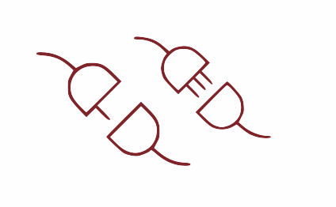

::: {.homepage-scroll-layout}

::: {.homepage-left}

{.homepage-rotated-image}

:::

::: {.homepage-right}




```{r}
library(tidyverse)

publications <- read_csv('publications/publication_list.csv')

publications %>% 
  arrange(date) %>% 
  pull(publication) %>% 
  str_replace('(https://.*)','[\\1](\\1)') %>% 
  str_c('- ',.,'\n\n') %>% 
  cat(file='publications/publication_list.qmd') 
```




:::

:::