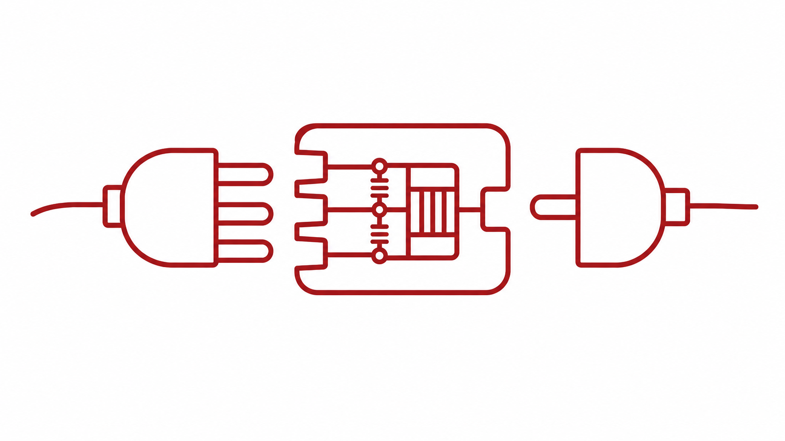

::: {.homepage-scroll-layout}

::: {.homepage-left}

{.homepage-rotated-image}

:::

::: {.homepage-right}

**Language is one of our most fundamental cognitive capacities.**

This Special Research Area (SFB) Network is developing a new approach tomodeling the linguistic system. The starting point is the hypothesis that the cognitive core of language ability is based on logical-symbolic calculations, but is embedded in a cognitive system of stochastic nature. 
As an interface between the symbolic and stochastic components, grammar uses the central optimization factors of redundancy and deficiency, which can underlie linguistic operations and make it possible to process both under- and over-specified inputs. 

The Network brings together the particularly strong linguistic research at the Universities of Graz, Vienna, and Salzburg and deals with uniformly defined, comprehensive empirical areas of grammar (pronouns and ellipsis). The sub-projects illuminate, classify and model these theoretically and empirically from the perspective of the concepts of redundancy and deficiency. Expected findings not only promise a deeper understanding of the basic mechanisms of the grammatical system, but also open up new perspectives for central questions in cognitive science regarding the role of language in cognition.

**This Research Network is financed by the Austrian Science Fund for Special Research Areas (SFB Grant F1003).**

:::

:::