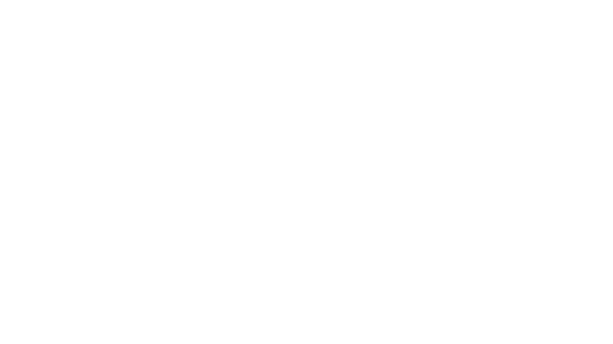

<div class="column-screen homepage-banner">

<div class="homepage-picture">

</div>

<div class="homepage-numbers">
<p>
<span class="homepage-stat"><span id="count1"></span>universities</span>
<span class="homepage-stat"><span id="count2"></span>projects</span>
<span class="homepage-stat"><span id="count3"></span>members</span>
</p>
</div>


</div>


# Welcome to the SFB Language between Redundancy and Deficiency {.column-page}


::: {.column-page-inset .homepage-welcome}

**Language is one of our most fundamental cognitive capacities.**
This <span class="highlight-red">Special Research Area (SFB) Network</span> is developing a new approach to modeling the linguistic system. The starting point is the hypothesis that the cognitive core of language ability is based on logical-symbolic calculations, but is embedded in a cognitive system of stochastic nature.
<span class="highlight-gray">As an interface between the symbolic and stochastic components, grammar uses the central optimization factors of redundancy and deficiency</span>, which can underlie linguistic operations and make it possible to process both under- and over-specified inputs.

The Network brings together the particularly strong linguistic research at the <span class="highlight-red">Universities of Graz, Vienna, and Salzburg</span> and deals with uniformly defined, comprehensive empirical areas of grammar (pronouns and ellipsis). The sub-projects illuminate, classify and model these theoretically and empirically from the perspective of the concepts of redundancy and deficiency. Expected findings not only promise a <span class="highlight-gray">deeper understanding of the basic mechanisms of the grammatical system</span>, but also open up new perspectives for central questions in cognitive science regarding the role of language in cognition.

**This Research Network is financed by the Austrian Science Fund for Special Research Areas (<a href="https://www.fwf.ac.at/en/research-radar/10.55776/F1003">SFB Grant F1003</a>).**
:::


# Explore {.column-page}

<div class="homepage-explore">

<a href="people.qmd"><div class="explore-card">Our team</div></a>
<a href="subprojects.qmd"><div class="explore-card">Our subprojects</div></a>
<a href="clusters.qmd"><div class="explore-card">Our research clusters</div></a>
<a href="publications.qmd"><div class="explore-card">Our publications</div></a>
<a href="communication.qmd"><div class="explore-card">Our science communication</div></a>

</div>


```{r}
#| output: asis
library(tidyverse)
library(readxl)

source("functions.R", local = knitr::knit_global())

events <- read_excel('event_list.xlsx')  %>% 
  filter(date>=today()) %>%
  arrange(date) %>%
  split_date(date) %>%
  head(2)

if (nrow(events) > 0) {

cat('<h1 class="column-page">Events</h3>')

if (nrow(events) == 1) {cat('<div class="homepage-events1">')}
  else {cat('<div class="homepage-events2">')}
  
for (i in 1:nrow(events)) {
  e <- events[i,]
  cat('<div>')
  cat('<details class="event-card">')
  cat('<summary>')
  cat('<div class="event-date">')
  cat('<span class="event-day">')
  cat(e$day)
  cat('</span>')
  cat('<span class="event-month">')
  cat(e$month)
  cat('</span>')
  cat('<span class="event-year">')
  cat(e$year)
  cat('</span>')
  cat('</div>')
  cat('<div class="event-summary">')
  cat('<span class="event-type">')
  cat(e$type)
  cat('</span>')
  cat('<h3>')
  cat(e$title)
  cat('</h3>')
  cat('<p class="event-people">')
  cat(e$people)
  cat('</p>')
  cat('<p class="event-affiliation">')
  cat(e$affiliation)
  cat('</p>')
  cat('</div>')
  cat('</summary>')
  cat('<div class="event-details">')
  cat(e$details)
  cat('</div>')
  cat('</details>')
  cat('</div>')
}

if (nrow(events) == 1) {
  cat('<a href="events.qmd" id="see-more-events1" class="see-more-events">')
  }
  else {
  cat('<a href="events.qmd" id="see-more-events2" class="see-more-events">')
}

cat('<div>')
cat('See more events')
cat('</div>')
cat('</a>')

cat('</div>')
}
```


# Latest publications {.column-page}


::: {.project-publications style="margin-bottom:0px;"}


```{r}
#| output: asis
library(tidyverse)
library(readxl)

source("functions.R", local = knitr::knit_global())

load_publications(path='sfb_output/publication_list.csv') %>%
  filter(type=='publication',year==format(today(),"20%y")) %>%
  head(3) %>%
  print_publications(header=FALSE)


```

::: 

<a href="publications.qmd" id="see-more-publications">
<div>
See more publications
</div>
</a>


<!-- ::: {.homepage-scroll-layout} -->

<!-- ::: {.homepage-left} -->

<!-- {.homepage-rotated-image} -->

<!-- ::: -->

<!-- ::: {.homepage-right} -->

<!-- **Language is one of our most fundamental cognitive capacities.** -->


<!-- ::: -->

<!-- ::: -->
