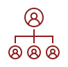
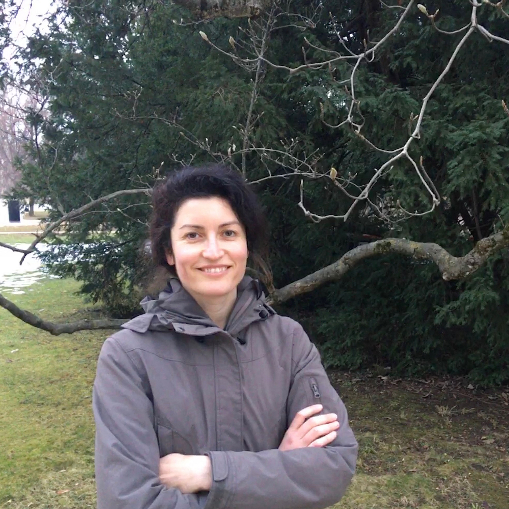
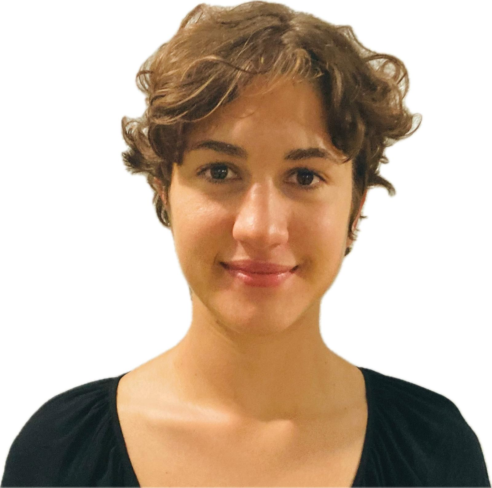

::: {.project-hero}

::: {.project-hero-logo}
{alt="P01 project logo"}
:::

::: {.project-hero-text}
### Project description

This subproject coordinates the activities of the Special Research Area “Language between Redundancy and Deficiency” and hosts two affiliated PhD projects funded by the University of Graz.
:::

:::

### Team

::: {.project-team-grid style="grid-template-columns: repeat(2, minmax(0, 1fr));"}

::: {.project-member-card}
{.project-member-photo}

#### Edgar Onea

**Principal Investigator**

University of Graz

[Institutional profile](https://example.com)
:::

::: {.project-member-card}
{.project-member-photo}

#### Sarah Melker

**Coordinating Postdoc**

University of Graz

Short description of the team member’s research interests, responsibilities, and institutional affiliation.

[Institutional profile](https://example.com)
:::

::: {.project-member-card}
{.project-member-photo}

#### Martina Barili

**Pre-doc Research Assistant**

University of Graz

Short description of the team member’s research interests, responsibilities, and institutional affiliation.

[Institutional profile](https://example.com)
:::

::: {.project-member-card}
{.project-member-photo}

#### Nastaran Divani

**Pre-doc Research Assistant**

University of Graz

Short description of the team member’s research interests, responsibilities, and institutional affiliation.

[Institutional profile](https://example.com)
:::

:::
