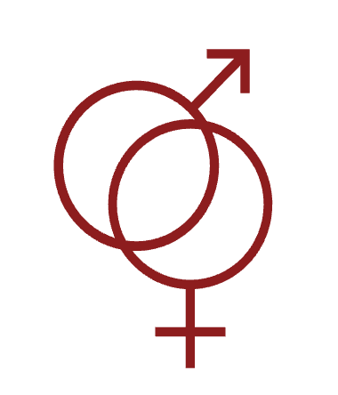
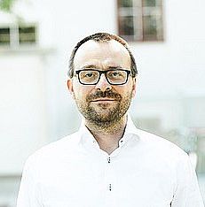
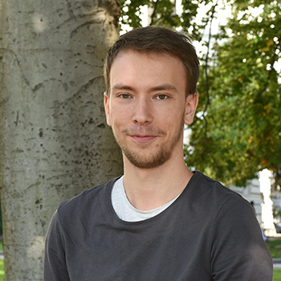

::: {.project-hero}

::: {.project-hero-logo}
{alt="P02 project logo"}
:::

::: {.project-hero-text}
### Project description

Subproject 2 is interested in an analysis of the discourse structural interpretation of gender features. The main focus of the subproject is the study of gender mismatches, which describe cases where grammatical gender does not agree with semantic gender (e.g., in German “das Mädchen”, where a neuter determiner is used in an expression referring to a semantically feminine girl).

The goal is to construct a detailed theory for the syntax-semantics interface of gender, enabling the explanation of gender mismatch phenomena. One central hypothesis is that gender might be described analogously to an analysis of so-called referential loci in sign languages. 


Methodologically, the subproject will conduct several empirical studies to gain a solid understanding of underlying phenomena. For theory building, frameworks of dynamical semantics and DRT will be the basis.
:::

:::

### Team

::: {.project-team-grid style="grid-template-columns: repeat(2, minmax(0, 1fr));"}

::: {.project-member-card}
{.project-member-photo}

#### Edgar Onea

**Principal Investigator**

University of Graz

Short description of the team member’s research interests, responsibilities, and institutional affiliation.

[Institutional profile](https://example.com)
:::

::: {.project-member-card}
{.project-member-photo}

#### Simon Dampfhofer

**Pre-doc Research Assistant**

University of Graz

Short description of the team member’s research interests, responsibilities, and institutional affiliation.

[Institutional profile](https://example.com)
:::

:::

### Cluster membership

::: {.project-clusters}

[Experimental Methods](../clusters/experimental-methods.qmd){.project-cluster-badge}

[Syntax and Binding Effects](../clusters/syntax-and-binding-effects.qmd){.project-cluster-badge}

[Semantics and Discourse Effects](../clusters/semantics-and-discourse-effects.qmd){.project-cluster-badge}

[Corpus and Annotation](../clusters/corpus-and-annotation.qmd){.project-cluster-badge}
:::

### Output

::: {.project-publications}

```{r}
#| output: asis

source("../functions.R", local = knitr::knit_global())

load_publications() %>% 
  filter(project=="P02") %>% 
  print_publications()

```

:::