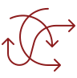

::: {.project-hero}

::: {.project-hero-logo}
{alt="P06 project logo"}
:::

::: {.project-hero-text}
### Project description
No description available on the Graz Website

:::

:::

### Team

::: {.project-team-grid}

::: {.project-member-card}
{.project-member-photo}

####  Dalina Kallulli

**Principal Investigator**

University of Vienna

Short description of the team member’s research interests, responsibilities within P07, and institutional affiliation.

[Institutional profile](https://example.com)
:::

::: {.project-member-card}
{.project-member-photo}

#### Adina Camelia Bleotu

**PostDoc**

Short description of the team member’s research interests, responsibilities within P07, and institutional affiliation.

[Institutional profile](https://example.com)
:::


::: {.project-member-card}
{.project-member-photo}

#### Ekaterina Levina 

**PostDoc **

Short description of the team member’s research interests, responsibilities within P07, and institutional affiliation.

[Institutional profile](https://example.com)
:::


:::

### Cluster membership

::: {.project-clusters}

[ROMANCE](../clusters/romance.qmd){.project-cluster-badge}

:::


### Output 


::: {.project-publications}

```{r}
#| output: asis

source("../functions.R", local = knitr::knit_global())

load_publications() %>% 
  filter(project=="P06") %>% 
  print_publications()


```

#### Talks

:::