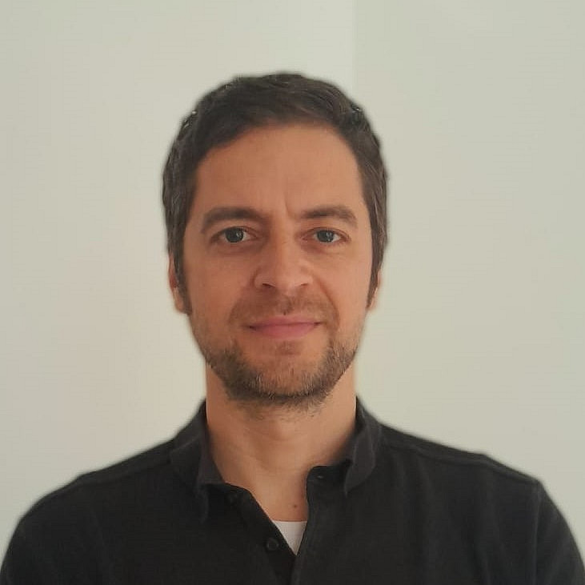
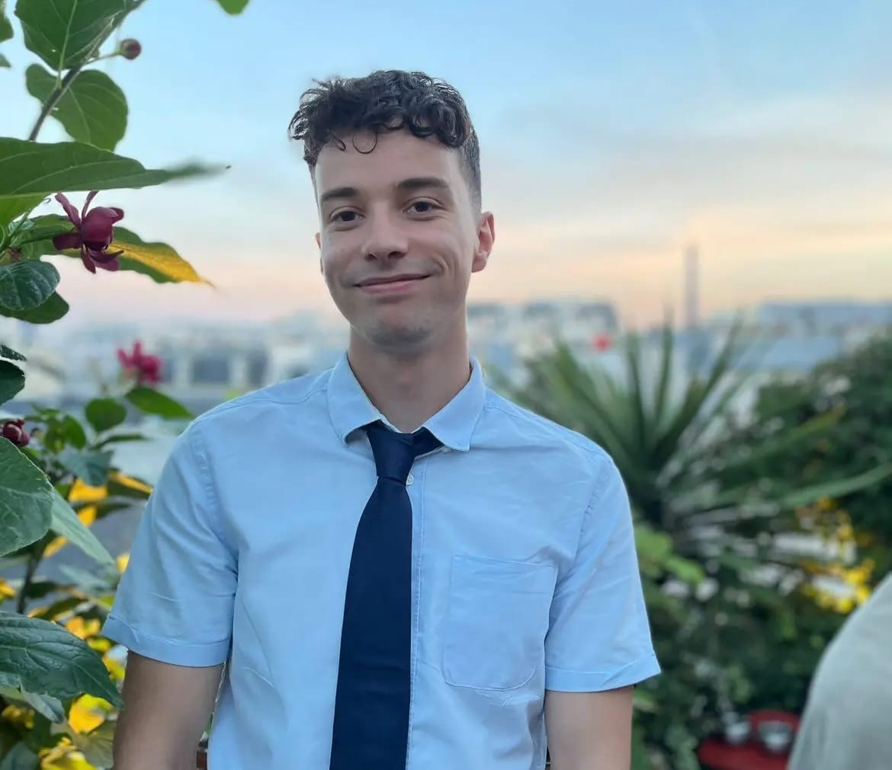

::: {.project-hero}

::: {.project-hero-logo}
{alt="P09 project logo"}
:::

::: {.project-hero-text}
### Project description

This subproject investigates the mapping between morphosyntactic and semantic features of French and Spanish personal pronouns from the perspective of R and D. These pronouns are highly flexible expressions due to their minimal descriptive content, and additional flexibility arises because their animacy features are not invariable (e.g., French strong pronouns are mostly used for human referents but can also refer to inanimate objects under certain conditions (Heidinger, 2019)). This subproject assumes that strong and weak pronouns are specified differently for animacy (Cardinaletti and Starke, 1999; Dobrovie-Sorin, 1999) and investigates how the animacy features of the pronouns are then manipulated by R and D to increase their flexibility and allow for non-canonical assignments (e.g., strong pronouns referring to inanimate objects). 

This subproject thus investigates how repetition and diffusion enable core grammar to cope with general cognitive pressure through additional flexibility; for example, through adjustments in pronoun choice triggered by the demands of resolving anaphora. The animacy features of French and Spanish personal pronouns (especially in PPs) offer insight into the diversity and limitations of such additional flexibility. The comparative perspective of French and Spanish allows the subproject to pursue a further theoretical objective directly related to the goals of the Collaborative Research Centre (CRC): The pronoun inventories of French and Spanish both include the opposition between strong and weak pronouns. However, the languages ​​differ in the availability of weak forms in PPs. This provides an ideal testbed to examine how repetition and diffusion function in minimally different pronoun systems. 


:::

:::

### Team

::: {.project-team-grid style="grid-template-columns: repeat(2, minmax(0, 1fr));"}

::: {.project-member-card}
{.project-member-photo}

#### Steffen Heidinger 

**Principal Investigator**

University of Graz

Short description of the team member’s research interests, responsibilities, and institutional affiliation.

[Institutional profile](https://example.com)
:::

::: {.project-member-card}
{.project-member-photo}

#### Yanis da Cunha

**Post-doc Research Assistant**

University of Graz

Short description of the team member’s research interests, responsibilities, and institutional affiliation.

[Institutional profile](https://example.com)
:::

:::

### Cluster membership

::: {.project-clusters}


[Romance Data](../clusters/romance.qmd){.project-cluster-badge}

[Experimental Methods](../clusters/experimental-methods.qmd){.project-cluster-badge}

[Clitic Pronouns](../clusters/clitic-pronouns.qmd){.project-cluster-badge}

[Zero Elements](../clusters/zero-elements.qmd){.project-cluster-badge}

[Semantics and Discourse Effects](../clusters/semantics-and-discourse-effects.qmd){.project-cluster-badge}

:::


### Output

::: {.project-publications}

```{r}
#| output: asis

source("../functions.R", local = knitr::knit_global())

load_publications() %>% 
  filter(project=="P09") %>% 
  print_publications()


```

:::